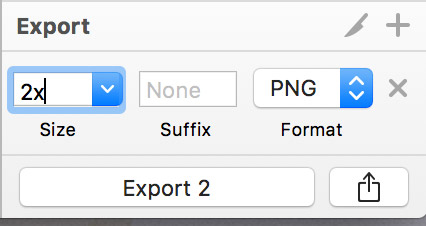

# Sketch &amp; Photoshop Basics

## Download the apps

To begin, download the free trials of both apps:

-[Photoshop](https://creative.adobe.com/products/download/photoshop)

-[Sketch](https://www.sketchapp.com/)

These will take a while to download and install, so make sure you give yourself time for this step!

## What is Photoshop/Sketch?

Photoshop and Sketch are used by designers to mock-up the websites you'll be creating - think of them as the blueprints to your digital construction project. 

### Photoshop vs. Sketch

- **Photoshop** was created in 1988 as a photo-editing and raster graphics editor. At the time of its conception, the landscape of web design was much different - there were no vector graphics or responsive sites. As a result, Photoshop's tools feel 'dated' to most modern designers, as the toolkit leans heavily towards photo-editing, rather than layout design.

	- Industry standard (for now)
	- Available on Mac and Windows
	- Rasterized graphics only (not scalable)
	- Great for photo-editing, difficult to create layouts in

- **Sketch** is a layout design app first released in 2010. It was created specifically to adress the areas of web development that photoshop couldn't - vector layouts, UX/UI, and rapid prototyping. It is in every way a better tool for web design than Photoshop, but the industry has been slow to adapt to it because of Photoshop's ubiquity. It also has no photo-editing and only limited shape-editing tools, meaning that any kind of actual graphic design will need to be done in Photoshop or Illustrator.

	- New kid on the block, but rapidly gaining ground
	- Available only on Mac
	- All vector (infinitely scalable)
	- Great for layout design, but not for graphic/photo editing

### Honorable Mention: Adobe Illustrator

Illustrator is a vector graphic editing app that works as a companion to photoshop. It is the currently the only industry standard for creating and editing vectors like icons, logos, poster art, etc. Most of the graphics you will need can be downloaded for free, but if you ever need to make custom icons, this will be your app of choice.

## What do I need to learn?

Honestly, not that much. Keep in mind that there are entire degree programs just to learn these two programs - but your interaction with design files will usually be pretty basic. You won't need to start files from scratch, worry about color profiles, packaging, or resolution. You will, however, need to know the apps well enough to navigate through them and pull out the information and design assets you need for your website. In a nutshell, you'll need to be able to:

1. Open the document, with all intended fonts and images
2. Navigate the document, zoom in on areas of interest, and toggle layer visibility
3. Measure the element in a page, so you can recreate them accurately
4. Obtain the correct hexidecimals for page colors
5. Obtain the correct font family/size/weight for page text
6. Export images/graphics in the correct size and resolution for your site

## Opening the file

Sounds simple, right? Unfortunately, designers are human too, and often forget to package all neccesary components when sending comps. Generally you will encounter this in two ways:

1. When opening a file, you get a pop-up notifying you that a font is missing.
2. When opening a file, you get a pop-up notifying you that an image is missing.

This happens for the same reason that you get 404s on CSS and JS files - the designer had the font/image on their local machine, but then broke that relative path by sending the comp to you.

If you're missing a font, notify your designer and have them send it to you, or have them explain how they want the font added. Fonts are [extremely expensive](http://www.typography.com/fonts/chronicle-display/styles/), so many companies only provide them to designers, and will pay for a web hosting package once the site is live. More common fonts can be easily Googled, downloaded, and installed very quickly.
If you're missing an image, however, no ammount of Googling will fix your problem - you'll need the designer to send it to you. 

## Navigation

Both Sketch and Photoshop have a default "Move" tool - it allows you to grab objects and move them around. This will be the tool you use most often, to the point that it's a stretch to even call it a tool.

**In Photoshop**, press "V". You can also select it from the left tool menu:

**In Sketch**, the move tool is toggled between each keypress. For instance, if you press "T" repeadedly, you toggle between the text tool and the move tool. There is no button to take you directly to the move tool, as Sketch recognizes it as a true default state. This can take a while to get the hang of.

### Moving Objects

Click on something and drag it. Super easy! Just make sure to Ctrl+Z if you're in Sketch - it saves automatically, so you can severly damage a file if you close out of it after dragging the composition apart.

### Moving the Artboard

In both programs, holding the spacebar will turn your cursor to a little hand. Now when you click and drag, you move the entire composition around, instead of individual objects.

### Zooming In and Out

**In Photoshop**, Command+Spacebar Turns your cursor to a Zoom-in tool; Command+Option+Spacebar turns it to a Zoom-out tool. Click to use. You can also use it by pressing "Z" or choosing the magnifying glass from the left menu.

**In Sketch**, hold command and use your mouse wheel (two finger scroll on a trackpad). You can also activate it by holding "Z" and drawing a box around the area you want to zoom in on. 

### Layers and Groups

Both programs are layer-based editors. Remember the transparent sheets of plastic paper used for overhead projectors in grade school? 

Sketch and Photoshop files are basically dozens of these transparencies stacked on top of eachother, each sheet being called a 'layer'. 

**In Photoshop**, they're generally on the bottom right of the right sidebar:

**In Sketch,** they're generally on the bottom left of the left sidebar:

In these menus, you can turn the layers on and off, rearrange them, group them, and apply layer-wide effects. 

## Measuring

When creating a site from a comp, it's **crucial** that you start by measuring the size of the page and its elements. Keep in mind that **many working designers do not not understand responsive design** and will make 'best case scenario' comps that neglect or ignore development neccesities. It is an extreme pain in the ass to change the size of page elements after you've contructed your frontend - so begin every project by answering these questions, asking designers, project managers, and even clients when neccessary:

1. What happens on a screen larger than the provided comp? 
	a. Do all elements stretch, or only some?
	b. Is there a max-width you want to set, in the case of TV-sized screens?
	c. Do you have photography/graphics that are high enough resolution to support your max size?

2. What happens on screens smaller than the provided comp?
	a. At what point do horizontally-lined elements begin to stack?
	b. Does any content dissapear at smaller sizes?
	c. Will you need different crops of your images for small screens?
	d. Is there a min-width for your page, or any elements?

Your client/designer will either have answers to these questions, or they'll need to get them to you. **Starting your work before these questions are answered will almost certainly result in costly rework.** Clients can be defensive of billing the extra hours needed to answer questions they see as 'obvious', and they may pressure you to start without all the info you need - if this is the case, do your best to explain that starting a website build without accurate measurements is the same as starting construciton on a blueprint without any labeled sizes on it. If they wouldn't guess with a physical building, you shouldn't for a website either. 

**In Photoshop**, press Shift+I until your cursor turns into a ruler icon. It shares a tool set with the eyedropper:

Clicking and dragging will now draw a line that measure an exact distance - you can hold shift to force the line into a straight direction. The result of your measurements will display in the top info bar:

**In Sketch**, simply click the object you want to measure and its size is displayed in the right sidebar menu:

 If objects are grouped, you may need to double-click to drill down through the layers. There are also different settings on the move tool that allow your clicks to go through groups directly into layers if you prefer.

## Color

Most companies have a style guide for their brand, which is shared with the design team before work is started. This document contains everything from explicit hexidecimals for the brand colors, to rules about how close other elements can be placed to the logo. As a result, it would be a bad idea to 'eyeball' details like this. 

Your best source for color information is this branding guideline - ask your designer if they can share it with you. If not, try and persuade your designer to send you whatever details they can. Failing that:

**In Photoshop**, you'll use Shift+I again - they eyedropper tool is on the same tool as the ruler. Click anywhere on your comp to add it's color to the current pallete:

Double-clicking the color swatch opens up a window in which you can grab the hexidecimal value (or RGB if you intend to animate it with CSS)

**In Sketch**, every object has an assigned color. When you click the object, it's color will appear in the right sidebar:

Clicking the color opens a window where you can grab the hex and RGB values. Also, note the "Document Colors" section of the color popup - If you have a really good designer, they will have already added all the brand colors into this section, allowing you to grab all of them at once. 

> Protip: Be sure to pay them back by documenting your code!

## Fonts

This one is pretty straightforward - use the text tool to select the text you're wondering about, and note it's family, weight, size, and lineheight.

**In Photoshop**, press 'T' to select the Text Tool, then click inside the text you're curious about. Info about that font will appear in the top info bar:

The 'Character' window will have even more details, like line-height and letter spacing (kerning, in Designer-speak). The only irrelivant detail pictured here is the field populated with 'sharp' - this is a menu of useless font variants that cannot be implemented with CSS. Feel free to ignore them.

**In Sketch**, select the piece of text with the Move tool and the font info will show up in the right sidebar menu:

Sketch was designed for web development, so all the informational field will be super useful and directly relevant to your CSS.

> Protip: Sketch has a number of useful right-click menu options, including 'Copy CSS Attributes': 

## Exporting Images

This is by far the most nuanced part of the proccess - exporting images. You'll be walking a very thin line between high-quality images and small file sizes. Here's some general guidelines:

### Cropping:
Choose the exact layer your image is on, and only export what you need - trim the object so that there's no needless whitespace or other objects attached to it.

### Format:

#### Rasterized: 

- JPG = Use for photographs only. These tend to be much higher file sizes, as the format was created to specifically reproduce highly complex digital camera images.

- PNG = Standard for most icons/graphics. Has background opacity, so that circular/non-square icons do not have a solid color background, but instead pick up the color of whatever is behind it

- GIF = Not used for much anymore. [Except for animated gifs, of course](https://media.giphy.com/media/Y8ocCgwtdj29O/giphy.gif).

#### Vector:

- SVG = Best for vector art of any kind. Can be scaled infintely.

- SVG Code = The greatest thing ever. Can't be directly exported from Sketch, but developers can open .SVG files in their code editors to grab it. Same benefits as SVG, but can also be manipulated with CSS and JavaScript.

### Size:

#### Rasterized:

1x = Normal size. Exactly how it is in the artboard.

2x = Double the dimensions of the width and height - so technically 4x the size. This is how you make retina images - the developer will then use CSS to squish the image back down to half the size, making the image super dense with pixels. The result is a super clean rasterized image.

#### Vector:

Vector images like SVGs are not affected by size - they're infinitely scalable.

### What should I name it?
- **Something logical.** The name should tell you what the image is without opening it.
- **No Version numbers.** Don't put yourself in a position where you and your peers aren't sure which image is 'approved'.
- **No Spaces.** Spaces are hard to recreate in code. It will almost always cause some kind of error. 

**In Sketch**, there is an 'Export' button on the very bottom right of the screen - click the object you want to export, set the neccessary fields, then click 'Export':

**In Photoshop**, you'll need to use the 'Save for Web' feature. Photoshop has cleverly hidden this feature to the point of near non-existence despite it being neccessary to export images, so press Shift+Option+Command+S to summon it back into existance. You'll be greeted with several menus to tweak your export:

## I still don't know what I'm doing

I know. Photoshop and Sketch are incredibly rich, deep programs with steep learning curves. **However**, this brief lesson has given you a considerable leg-up to other bootcamp grads who will never even open these programs - until they're asked to on the job. Take some time before your trials expire to familiarize yourself with these programs as much as possible, and you might very well be the only full-stack developer in your company to know how to interface with designers and their tool kit. 

